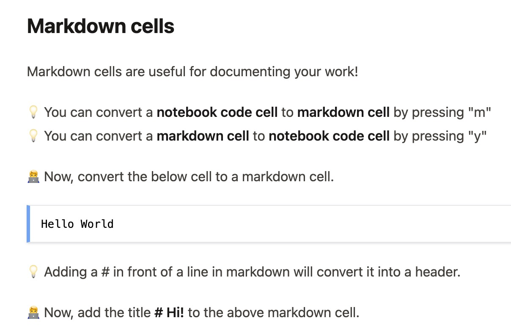

# Portfolio

## Content curation in Jupyter

I've curated a 3 days python training course, a writing sample can be found in the next chapter called
[Writing Sample](./writing-sample)  

:::{tip} Screenshot preview from wirting sample.

:::

Additionally, the full [course material](https://github.com/mito-ds/training-materials) is also available.

 Also, I've written this ipyreact [tutorial](https://github.com/widgetti/ipyreact/blob/master/examples/full_tutorial.ipynb).

## My Projects

:::{figure} #project-tomo
:name: #fig-project-tomo
Description of the figure.
:::

:::{figure} #project-compare_view
:name: #fig-project-compare_view
Description of the figure.
:::

:::{figure} #project-plywood
:name: #fig-project-plywood
Description of the figure.
:::

:::{figure} #project-tldraw
:name: #fig-project-tldraw
Description of the figure.
:::

## Content curation in myst

:::{figure} #myst1
:name: #fig-myst1
Description of the figure.
:::

:::{figure} #myst2
:name: #fig-myst2
Description of the figure.
:::

## Content curation in Manim

:::{figure} #manim-1
:name: #fig-manim-1
Description of the figure.
:::

:::{figure} #manim-2
:name: #fig-manim-2
Description of the figure.
:::

:::{figure} #manim-3
:name: #fig-manim-3
Description of the figure.
:::

:::{figure} #manim-4
:name: #fig-manim-4
Description of the figure.
:::

## Scientific publications

* Human lung virtual histology by multi-scale x-ray phase-contrast computed tomography 
* napari: a multi-dimensional image viewer for Python 

See my record at: https://orcid.org/0009-0007-3670-9969

